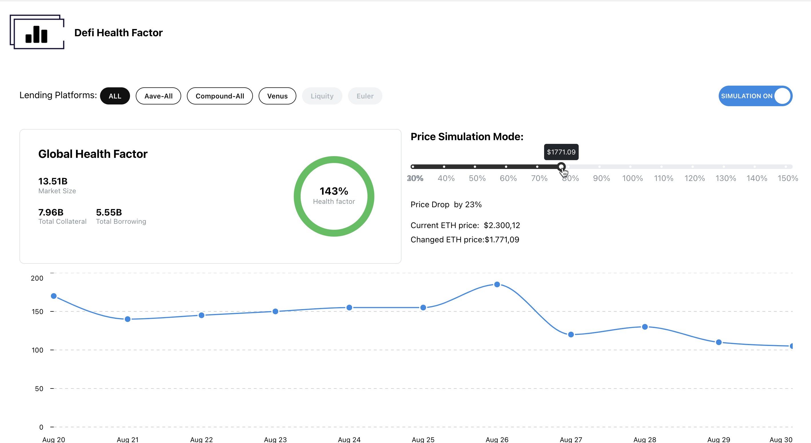

# Health Factor

**DeFi Health Factor Analytical Dashboard & Simulator**  

- Calculate and aggregate the global DeFi Health Factor from lending platforms.

The project is split into 3 parts:

### Frontend 
[Frontend Repository](https://github.com/thenextblock/DefiHealthFactor/tree/main/frontend)
- Contains the Defi Health Factor Chart and Price Simulation interface.

### Backend 
[Backend Repository](https://github.com/thenextblock/DefiHealthFactor/tree/main/Backend)
- Standard REST API.

### Indexers 
[Indexers Repository](https://github.com/thenextblock/DefiHealthFactor/tree/main/indexers)
- ENVIO indexer fetching and indexing data from the chain.

<!-- [link title](#) -->

## Project Description

### DeFi Health Factor Analytical Dashboard & Simulator

An analytical dashboard that provides real-time indexed data from different lending platforms (currently only [AAVE](https://aave.com/)). Our focus is on the basic DeFi indicator, the **Health Factor**, which is calculated using the simple formula: `Total Collateral / Total Borrow `. The platform will display this aggregated indicator across all DeFi platforms, as well as by individual chains and protocols.

Additionally, we will implement a **Price Simulator** where users can simulate changes in collateral prices. This feature will generate reports on how many accounts would be liquidated and the potential amount of assets that could be dumped on the market, allowing users to visualize the spiral effect.

## How it's Made

We will utilize *Envio HyperIndex* or *HyperSync* to store real-time data in a PostgreSQL database. For simulations, DeFi health factor calculations, and additional queries, we will write and execute SQL queries directly at the database level. Initially, Envio will be used solely for data indexing.

For the frontend, we will use a classic dashboard interface connected to our indexed database via an API. The backend will be a simple REST API built with TypeScript and Node.js.
